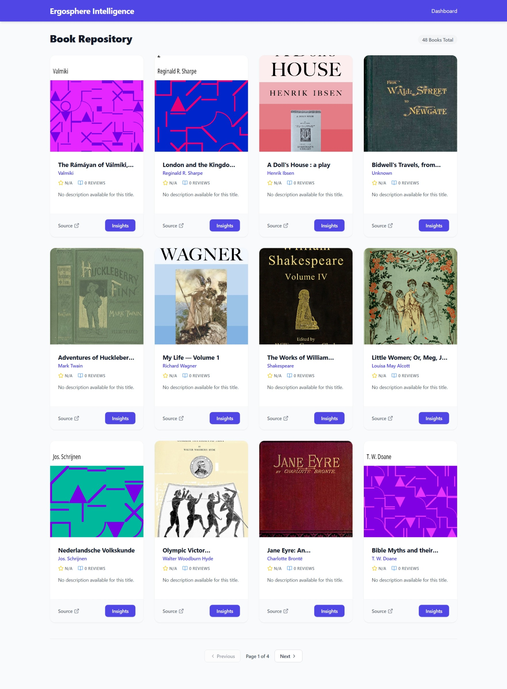
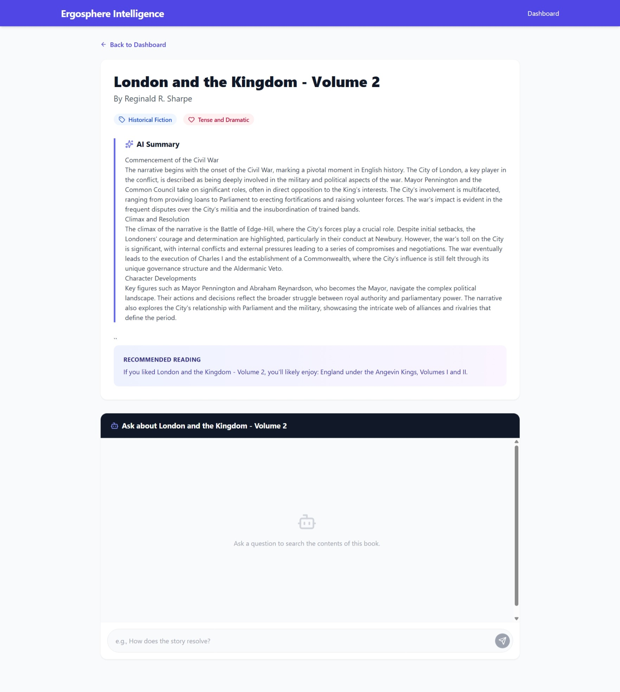
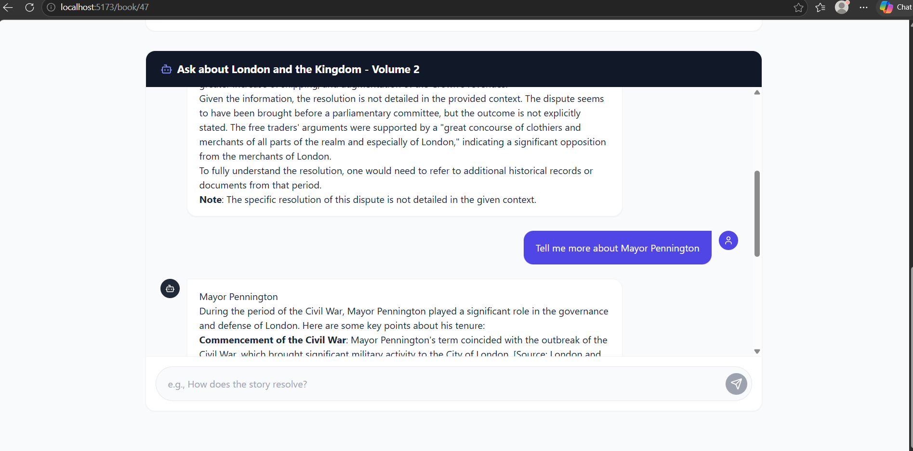

# 📚 Ergosphere Document Intelligence Platform

A full-stack, AI-powered Retrieval-Augmented Generation (RAG) platform. This application automates the multimodal ingestion of Project Gutenberg books, generates structured literary insights via LLMs, and provides a real-time conversational interface to query document contents.

---

## ✨ Assignment Milestones & Bonus Points Claimed

This project fulfills all core requirements and explicitly tackles the following bonus challenges:

- **🏆 Bulk Multimodal Scraping Pipeline:** Custom Django management command (`scrape_top_50`) that uses headless Selenium to safely scrape, chunk, and embed the Top 50 books in memory-safe batches of 10.
- **🏆 Production-Grade Caching:** Implemented DRF `@cache_page` to cache the dashboard JSON payload, preventing database bottlenecks.
- **🏆 Scalable Pagination:** Integrated DRF `PageNumberPagination` (12 items per page) with a custom React UI to handle massive datasets gracefully.
- **Advanced RAG (Streaming):** Server-Sent Events (SSE) pipeline that streams LLM tokens to the React frontend for a real-time, ChatGPT-like typing effect.
- **Deterministic AI JSON:** Strict prompt engineering ensures the 7B LLM consistently outputs deeply structured Markdown summaries, genres, and sentiments without breaking the API.

---

## 📸 Application Screenshots

*(Reviewer Note: UI features Tailwind CSS, Skeleton Loaders, and dynamic fallbacks)*


*Figure 1: Paginated, cached dashboard displaying 50 ingested books.*


*Figure 2: Detail page featuring LLM-generated Markdown summaries and metadata.*


*Figure 3: Real-time RAG chat streaming context-aware answers.*

---

## 🛠️ Technology Stack

- **Backend Architecture:** Django, Django REST Framework (DRF)
- **Database Layer:** MySQL (Relational Metadata) & ChromaDB (Vector Embeddings)
- **Frontend App:** React (Vite), Tailwind CSS, Lucide React (Icons), React Markdown
- **AI & ML Engine:** Hugging Face API (`Qwen/Qwen2.5-7B-Instruct`), SentenceTransformers (`all-MiniLM-L6-v2`), LangChain
- **Scraping & Parsing:** Selenium, BeautifulSoup, Markdownify

---

## 🚀 Local Development Setup

### 1. Environment & Database
Make sure you have MySQL running locally or via Docker. Create a database for the project.

### 2. Backend Setup
```bash
cd book-insight-backend

# Initialize virtual environment
python -m venv venv
source venv/bin/activate  # Windows: venv\Scripts\activate

# Install dependencies
pip install -r requirements.txt

# Environment Variables (Create a .env file)
# HF_TOKEN=your_hugging_face_token
# DB_NAME=your_db_name
# DB_USER=your_db_user
# DB_PASSWORD=your_db_pass

# Run Migrations
python manage.py makemigrations
python manage.py migrate

# Start Server
python manage.py runserver 0.0.0.0:8000
```

### 3. Frontend Setup
```bash
cd book-insight-frontend

# Install dependencies
npm install

# Start Vite Development Server
npm run dev
```

---

## 📚 Data Ingestion (The Bulk Scraper)

To populate the database with the Top 50 Project Gutenberg books, run the custom management command. This script will safely download the HTML/Images, parse them to Markdown, chunk them via LangChain, and store the embeddings in ChromaDB.

```bash
python manage.py scrape_top_50
```

---

## 🔌 API Architecture & Endpoints

### 1. List Books
- **Endpoint:** `GET /api/books/`
- **Description:** Returns a paginated list of all ingested books. Excludes raw HTML to ensure lightning-fast payload delivery.
- **Query Parameters:** `?page=<number>` (default: 1)
- **Performance:** Cached via DRF `@cache_page` for 15 minutes to handle heavy traffic.
- **Success Response (200 OK):**
  ```json
  {
    "count": 50,
    "next": "http://localhost:8000/api/books/?page=2",
    "previous": null,
    "results": [
      {
        "id": 1,
        "title": "Frankenstein",
        "author": "Mary Shelley",
        "rating": "4.50",
        "cover_image": "/media/covers/frankenstein.jpg"
      }
    ]
  }
  ```

### 2. Retrieve Book Details & Insights
- **Endpoint:** `GET /api/books/{id}/`
- **Description:** Retrieves full details for a specific book, including the AI-generated literary analysis.
- **Architecture Note (Lazy-Loading):** If the AI insights (Summary, Genre, Sentiment) do not exist yet, the API triggers a synchronous LLM generation, saves the result to the `BookInsight` table, and then returns the payload.
- **Success Response (200 OK):**
  ```json
  {
    "id": 1,
    "title": "Frankenstein",
    "author": "Mary Shelley",
    "description": "...",
    "insights": {
      "summary": "### The Inciting Incident\n...",
      "genre": "Gothic Sci-Fi",
      "sentiment": "Dark, Tragic, Philosophical"
    }
  }
  ```

### 3. Get Book Recommendations
- **Endpoint:** `GET /api/books/{id}/recommend/`
- **Description:** Uses semantic vector similarity search via ChromaDB to find thematically similar books based on the target book's chunks.
- **Success Response (200 OK):**
  ```json
  {
    "target_book": "Pride and Prejudice",
    "recommendation": "If you liked Pride and Prejudice, you'll likely enjoy: Sense and Sensibility, Jane Eyre."
  }
  ```

### 4. RAG Chat Query (Streaming)
- **Endpoint:** `POST /api/rag/query/`
- **Description:** Core RAG endpoint. Searches the ChromaDB vector store for relevant document chunks based on the `book_id` and streams the context-aware LLM response back using Server-Sent Events (SSE).
- **Request Body:**
  ```json
  {
    "question": "What happens to the monster at the end?",
    "book_id": 1
  }
  ```
- **Response (`text/event-stream`):** Streams raw markdown tokens (e.g., `data: The\n\ndata: monster\n\ndata: flees...`)

---

## 💬 Sample RAG Q&A

Here are a few examples of the Retrieval-Augmented Generation system in action, demonstrating context-aware citations and Markdown formatting from the UI:

**Question 1:** *"How does Mr. Darcy's proposal to Elizabeth go?" (Context: Pride and Prejudice)*
> **Answer:** It goes disastrously. Mr. Darcy insults Elizabeth's family and connections while proposing, focusing heavily on how his affection overcame his better judgment. Elizabeth flatly rejects him, citing his arrogance, conceit, and his role in separating her sister Jane from Mr. Bingley. *(Source: Pride and Prejudice)*

**Question 2:** *"What is the monster's main demand to Victor?" (Context: Frankenstein)*
> **Answer:** The monster explicitly demands that Victor create a **female companion** for him, one who is as deformed and isolated as he is. He promises that if Victor completes this task, he will take his new mate and flee to the vast wilds of South America, never to bother mankind again. *(Source: Frankenstein)*
